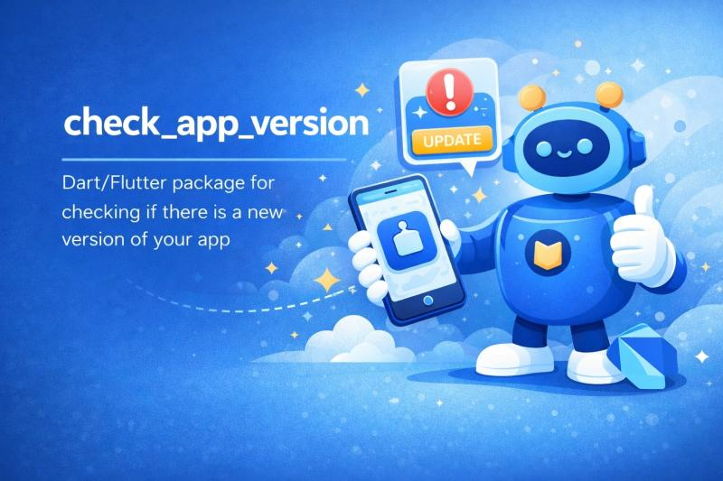

# 🚀 check_app_version

<p align="center">
  
</p>

[](https://pub.dev/packages/check_app_version)
[](https://pub.dev)
[](https://flutter.dev)
[](https://opensource.org/licenses/MIT)

**The ultimate, modern, and elegant solution to manage app updates in your Flutter applications (supporting both soft and mandatory updates).**

No complex setups, no headaches. With a single line of code, you can evaluate the installed version, compare it with your server, and present gorgeous, ready-to-use Material 3 UI presentations.

---

## ✨ Why choose `check_app_version`?

*   **⚡ 30-Second Implementation**: A single, clean static entry point handles all the heavy lifting.
*   **🎨 Premium Built-in UIs**: Gorgeous and responsive dialogs, bottom sheets, full-screen pages, and overlay banners that automatically adapt to light/dark themes.
*   **📦 Granular JSON Schema**: Configure separate update policies for Android and iOS (e.g. enforce a mandatory update on iOS but keep it optional on Android).
*   **⚙️ Intelligent Caching**: Prevents redundant network requests by caching decisions in memory (10-minute default TTL).
*   **🛡️ Battle-Tested & Resilient (Zero Crash)**: Gracefully handles network failures or malformed JSON payloads without ever crashing your host application.

---

## 🚀 Quick Start (Get Ready in 3 Steps)

### 1. Prepare your JSON (can be a static file or a dynamic response from your backend API)

> [!NOTE]
> You don't have to host a static `.json` file! The source can be **any REST API, Cloud Function, or backend microservice** querying your database (PostgreSQL, MongoDB, Firebase, Supabase, Node.js, etc.) as long as it returns a JSON response matching this schema:

```json
{
  "platforms": {
    "android": {
      "bundle_id": "com.example.myapp",
      "min_required_version": "1.5.0",
      "min_required_build": 36,
      "latest_version": "1.6.0",
      "latest_build": 40,
      "force_update": false
    },
    "ios": {
      "bundle_id": "com.example.myapp",
      "min_required_version": "1.5.0",
      "min_required_build": 36,
      "latest_version": "1.6.0",
      "latest_build": 40,
      "force_update": true,
      "app_store_id": "123456789"
    }
  }
}
```

### 2. Fetch the Update Decision

Invoke the check on your application startup:

```dart
import 'package:check_app_version/check_app_version.dart';

final decision = await CheckAppVersion.get(
  'https://yoursite.com/version.json',
);
```

### 3. Display the UI

If an update is required, render one of the stunning built-in layouts:

```dart
if (decision.shouldUpdate) {
  CheckAppVersion.showUpdateDialog(
    context,
    decision: decision,
    onOpenStore: () => launchUrl(storeUri),
  );
}
```

---

## 🎨 Choose Your Presentation Layout!

You can pick between 4 different layout styles based on your preferred User Experience:

### 💬 1. Classic Dialog (`showUpdateDialog`)
A clean, elegant popup card overlaying your content.

```dart
CheckAppVersion.showUpdateDialog(
  context,
  decision: decision,
  onOpenStore: () => openStore(),
);
```

### 📋 2. Modal Bottom Sheet (`showUpdateModal`)
A modern sheet sliding up from the bottom. Perfect for non-blocking soft updates.

```dart
CheckAppVersion.showUpdateModal(
  context,
  decision: decision,
  onOpenStore: () => openStore(),
);
```

### 🖥️ 3. Full-Screen Blocking Page (`showUpdatePage`)
An immersive full-screen view. Best for mandatory updates (`force_update: true`).

```dart
CheckAppVersion.showUpdatePage(
  context,
  decision: decision,
  onOpenStore: () => openStore(),
);
```

### 🔔 4. Overlay Banner (`UpdateOverlay`)
A non-intrusive stack banner positioned at the top of your screen.

```dart
UpdateOverlay(
  decision: decision,
  onOpenStore: () => openStore(),
  onDismiss: () => hideBanner(),
)
```

> [!TIP]
> **Automatic Dialog Dismissal**: All UI presentation layouts feature `popAfterPressed: true` by default. When the user taps the update button, the modal or dialog closes automatically!

---

## 🛠️ Custom UI? No Problem!

If you prefer not to use our pre-built widgets, you can easily build your own custom interface. Since the business logic is fully decoupled from the UI, simply run the silent check and use the `UpdateDecision` properties:

```dart
final decision = await CheckAppVersion.get('https://yoursite.com/version.json');

if (decision.shouldUpdate) {
  if (decision.isForceUpdate) {
    showMyCustomBlockingUI(
      requiredMinVersion: decision.requiredMinVersion,
      storeId: decision.appStoreId,
    );
  } else {
    showMyCustomSoftBanner(
      latestVersion: decision.latestVersion,
    );
  }
}
```

### Available Properties on `UpdateDecision`:
*   `shouldUpdate` (`bool`): `true` if an update is available.
*   `isForceUpdate` (`bool`): `true` if the update is mandatory.
*   `reason` (`UpdateReason`): Why the decision was made (e.g. `.belowMinimum`, `.belowLatest`, `.upToDate`, `.networkError`, `.parseError`).
*   `installedVersion` & `installedBuild` (`String` / `int`): The currently running app configurations.
*   `requiredMinVersion` & `requiredMinBuild` (`String` / `int`): The minimum configurations required by the server.
*   `latestVersion` & `latestBuild` (`String` / `int`): The latest releases available on the server.
*   `appStoreId` (`String`): The App Store product ID (useful for launcher links).

---

## ⚙️ Caching & Custom Policies

Decisions are automatically cached in memory for **10 minutes**. Customize this behavior using `UpdatePolicy`:

```dart
final decision = await CheckAppVersion.get(
  url,
  policy: const UpdatePolicy(
    forceRefresh: true, // Bypass cache lookup and fetch fresh data
    cacheTtl: Duration(minutes: 5), // Adjust cache duration to 5 minutes
    httpTimeout: Duration(seconds: 3), // Set network request timeout
  ),
);
```

---

## 🔄 Effortless Migration from v2.x to v3.0.0

Version 3.0.0 dramatically simplifies your Dart codebase and enhances the JSON format. Let's migrate in a breeze:

### 1. JSON Schema Migration

| v2.x (Legacy Flat Schema) | v3.0.0 (Modern Platform-Nested Schema) |
|---|---|
| Shared versioning logic across all platforms. | Totally isolated configurations per platform. |
| Flat keys (`new_app_version`, `android_package`). | Dedicated platform nodes (`platforms.android`). |

```json
// NEW v3.0.0 SCHEMA
{
  "platforms": {
    "android": {
      "bundle_id": "com.my.app",
      "min_required_version": "1.0.0",
      "min_required_build": 10
    }
  }
}
```

### 2. Dart API Migration

#### Before (v2.x - Widget-Instantiation)
```dart
final dialog = AppVersionDialog(
  jsonUrl: 'https://example.com/version.json',
  context: context,
  title: 'New Update Available',
  onPressConfirm: () => openStore(),
);
await dialog.show();
```

#### Now (v3.0.0 - Clean Static Facade)
```dart
// 1. Evaluate versions
final decision = await CheckAppVersion.get('https://example.com/version.json');

// 2. Render UI
if (decision.shouldUpdate) {
  CheckAppVersion.showUpdateDialog(
    context,
    decision: decision,
    onOpenStore: () => openStore(),
  );
}
```
